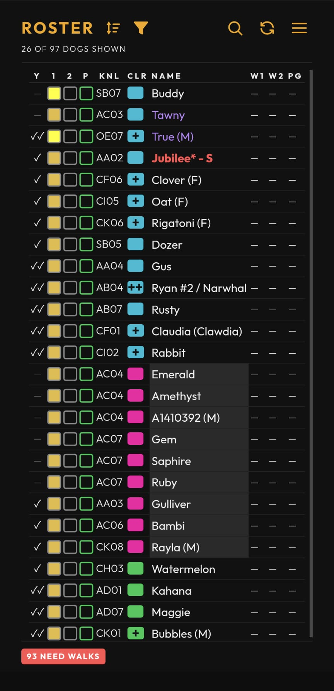
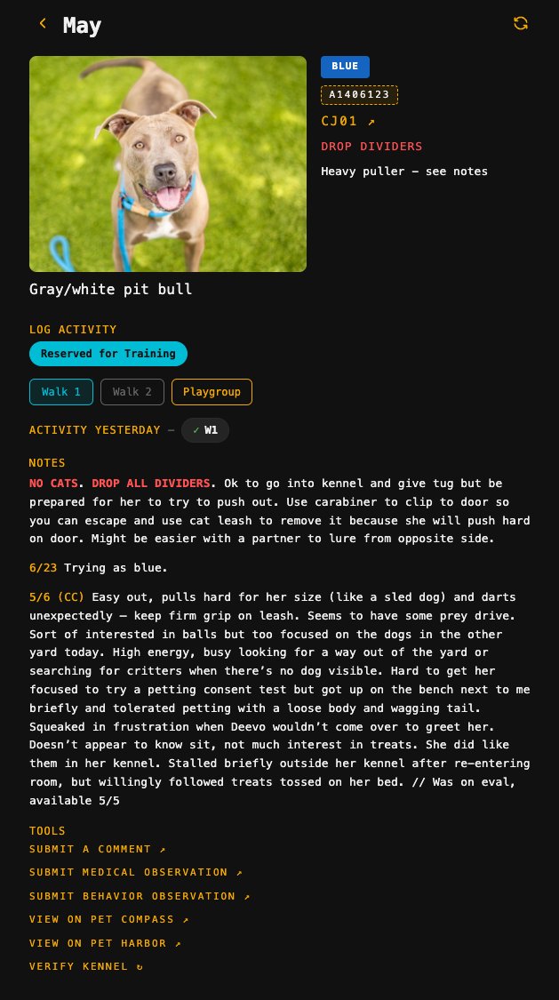
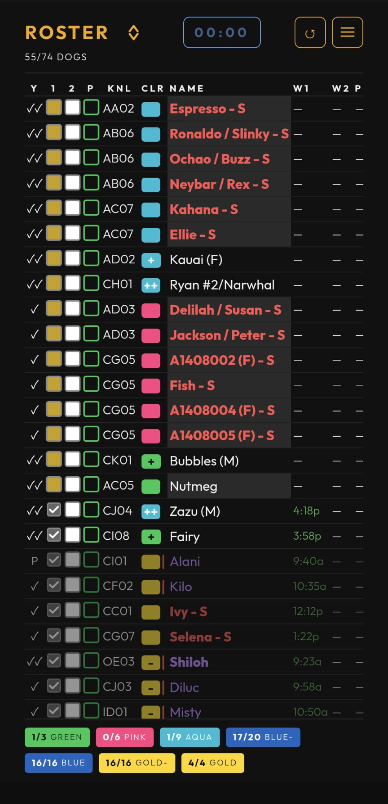
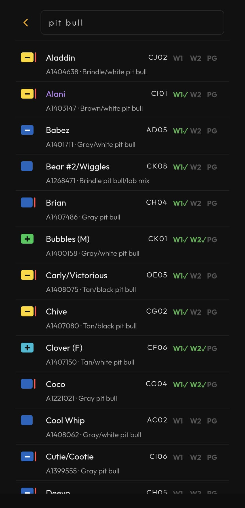
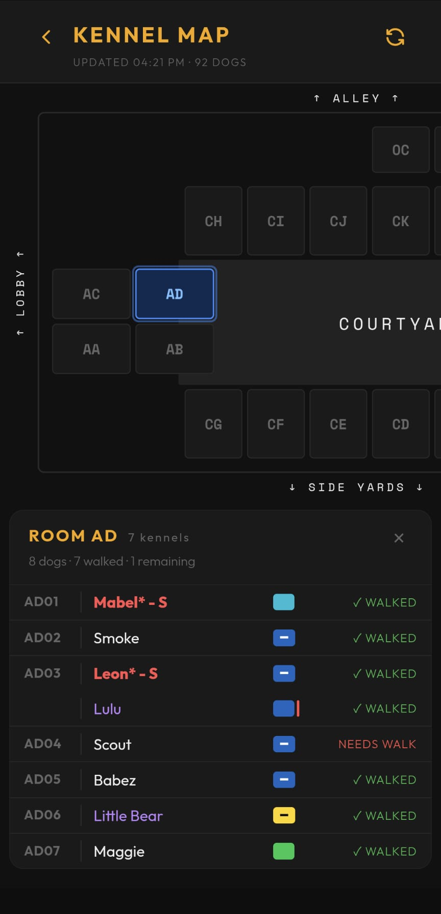

# Walker Guide

A tour of the app for shelter walkers.

Jump to&hellip;

- [Signing In](#signing-in)
- [Add To Your Home Screen](#add-to-your-home-screen)
- [The Roster Screen](#the-roster-screen)
- [The Dog Detail Page](#the-dog-detail-page)
- [Color Grades](#color-grades)
- [Cell Colors](#cell-colors)
- [The WALK ORDER Sort](#the-walk-order-sort)
- [The Search Screen](#the-search-screen)
- [The Kennel Map](#the-kennel-map)
- [The Walk Timer](#the-walk-timer)
- [Action Buttons](#action-buttons)
- [Resources](#resources)
- [Settings](#settings)
- [FAQ](#faq)

## Signing in

DWA uses your Google account. Tap **Sign in with Google** on the launch screen
and pick your address. If you're new, you'll land on a request-access form —
fill it in and an admin will be notified. Once an admin approves you, you'll get
a welcome email, and your next Google sign-in will let you straight in. If
sign-in keeps failing, message an admin.

## Add to your home screen

Install DWA as an app icon so it opens full-screen, without the browser bar.

### Android (Chrome)

1. Open **dwa.kirbsauce.com** in Chrome.
2. Tap the **⋮** menu (top right) and choose **Add to Home screen** — or tap
   **Install** if Chrome already offered you a banner.
3. Confirm by tapping **Add** / **Install**.

### iOS (Safari)

1. Open **dwa.kirbsauce.com** in Safari.
2. Tap the **Share** icon (the square with an arrow pointing up).
3. Scroll down and tap **Add to Home Screen**.
4. Tap **Add** in the top right.

Either way, you'll get a DWA icon on your home screen that opens the app
full-screen, just like a native app.

## The roster screen

The roster lists every walkable dog in the kennel today, ordered by the current
sort (WALK ORDER by default). Each row shows, left to right:

- **Y** — yesterday's activity at a glance (walked once, twice, playgroup, or
  nothing / recent surgery).
- **1 · 2 · P** — status icons for Walk 1, Walk 2, and Playgroup. A filled,
  checked icon means done; an outline means pending. Color highlights flag what's
  urgent or reserved (see [Cell colors](#cell-colors)).
- **KNL** — the kennel to find the dog in (e.g. `AC03`).
- **CLR** — the dog's color grade (see [Color grades](#color-grades)).
- **NAME** — the dog's name.
- **W1 · W2 · PG** — the time each activity was logged, or a check once done.

**Tap any row to open the dog's page** — that's where you log walks, check
kennel location, and read notes.

Below the table, a row of pills summarizes what's outstanding: a **`N NEED
WALKS`** count (dogs with no activity logged today) that's always shown — red
while dogs still need a walk, green once it hits zero — and, when applicable,
**`N TRAINING RSVD`** / **`N PLAYGROUP RSVD`** counts for dogs reserved but
not yet attended. These counts reflect the full roster regardless of any
active filter.

## The dog detail page

- **ID** — tap it to copy the animal ID to your clipboard; the button flashes
  **Copied!** for a moment to confirm.
- **Kennel** (e.g. `AC03`) — tap it to jump straight to the **Kennel Map**,
  centered on that dog's room.
- **Photo** — tap it to view full-screen.
- Other information may show up below these, when it applies to that
  dog — flags like **Potty Dog**, **Recent surgery**, **Adoption hold**, and
  **DROP DIVIDERS**.

### Logging a walk

Under **LOG ACTIVITY** you'll see up to three buttons:

- **Walk 1**
- **Walk 2** — locked until Walk 1 is logged.
- **Playgroup**

Tap a button to log that activity. Once logged, the button switches to show the
time it happened, e.g. **`W1 @ 8:47`**. To undo a mistake, tap the logged button
again to clear it — except Walk 1, which locks once Walk 2 is logged; clear
Walk 2 first if you need to undo Walk 1. Each tap writes back to the shelter
Google Sheet and syncs across devices instantly, so what you log shows up for
everyone right away.

#### Reservations

A dog can be reserved before you walk it. When so, a pill appears above the
buttons:

- **Reserved for Playgroup** (green) — hold the dog for playgroup.
- **Reserved for Training** (cyan) — the Walk 1 button also gets a cyan border;
  the dog is spoken for by training.

#### Walk notes

Below the buttons, the dog's most recent note for each activity is shown. If
there's more than one note for an activity, a **`+N more`** link appears — tap it
to read the full history for that slot.

### Notes

Further down, a **NOTES** section holds the dog's ongoing care and behavior
notes — anything worth knowing before you walk it. Words in ALL CAPS (like
**DROP DIVIDERS** or **NO CATS**) are highlighted in red so warnings jump out.

### Useful links

At the bottom, a **TOOLS** section links out to other systems:

- **Submit a Comment** / **Submit Medical Observation** / **Submit Behavior
  Observation** — opens a form to report something about the dog.
- **View on Pet Compass** / **View on Pet Harbor** — opens the dog's record in
  the county's own systems.
- **Verify Kennel** — cross-checks the dog's kennel against Pet Compass and
  flags it if they don't match.

## Color grades

Every dog wears a color from easiest to hardest:

> Green →
> Pink →
> Aqua →
> Blue− →
> Blue →
> Gold− →
> Gold →
> Red →
> Black

Your own color grade (shown in **Settings → WALKER PROFILE**, set by an admin) is
the **hardest** color you're cleared to walk. You can walk any dog **at or below**
your grade. Dogs above your grade appear dimmed and drop to the bottom of the
list when a view-based sort like WALK ORDER is active.

## Cell colors

The status-icon highlights on the roster tell you what's pending:

- **Yellow / amber** on a walk icon — that walk slot is urgent.
- **Green** on Playgroup — the dog is reserved for playgroup but hasn't attended.
- **Cyan** on Walk 1 — the dog is reserved for training but hasn't walked.

Once an activity is logged, its highlight clears — the check wins over the color.

## The WALK ORDER sort

The default **WALK ORDER** sort puts the hardest color you can walk at the top.
Within a color, dogs run urgent (yellow) → amber → neutral → reserved → done.
Dogs above your color grade fall to the bottom, dimmed.

*This example is what an **Aqua**-level walker sees — which dogs sit at the top,
and which dim out, depends on your own color grade.*

Open the **SORT BY** overlay from the sort icon in the header to pick another
sort. View-based sorts like WALK ORDER are **one-way** orderings — the asc/desc
toggle only applies to plain field sorts (**Kennel**, **Color**, **Name**). Use
**CLEAR SORT** to drop back to the default.

## The Search screen

Open **Search** from the nav menu to find a dog by name, ID, kennel, breed,
color, or even a word from its notes — matches appear as you type, with name
matches listed first.

Each result shows the dog's color, name, kennel, and today's **W1 · W2 · PG**
ticks (green once logged). Tap a result to open that dog's page.

## The Kennel Map

Open **Kennel Map** from the nav menu — or tap a dog's kennel on its detail
page to jump straight there, centered on that room.

Tap a room to see its kennels. Each row shows the dog's name, color, and walk
status (**✓ WALKED**, **✓ PLAYGROUP**, or **NEEDS WALK**), plus a running tally
of how many dogs in that room still need a walk. Tap a dog's row to open its
detail page.

Kennels that look empty, or dogs that aren't on your walk list, can still show
up here — the map cross-checks against Pet Compass, so it'll flag a mismatch
(⚠) if a dog is actually housed somewhere different than the roster says.

## The walk timer

If you enable **Timer** in **Settings → APPEARANCE**, a small `mm:ss` timer
appears **on the roster page** — in the header (top nav) or bottom-right (bottom
nav) — to help you keep track of how long you've had a dog out. Tap it to open
play / pause / reset controls, and reset it each time you head out with a new
dog. It caps at **30:00**.

## Action buttons

**Settings → APPEARANCE → Action buttons** lets you move the header's icon
buttons (back, refresh, menu, and so on) between **TOP** (the normal header) and
**BOTTOM** — a bar docked near the bottom of the screen instead. If you're
navigating the app one-handed, BOTTOM keeps those buttons within thumb reach
instead of making you stretch to the top of the screen.

## Resources

The **Resources** screen (in the nav menu) has three sections:

- **Links** — a **Walker Guide** link that opens this guide in your browser.
- **Feedback** — a **Submit Bug/Enhancement** button for reporting a problem
  or requesting a feature.
- **Adopter Resources** — a QR code for the adoption info page. Tap it to
  open, or let an adopter scan it to share the info.

## Settings

Open **Settings** from the nav menu. Walker-facing options:

- **WALKER PROFILE** — your color level (read-only, set by an admin) and an
  optional **alternate email**.
- **APPEARANCE** — **Theme** (dark / light), **Font size**, **Action buttons**
  (nav at top or bottom, for one-handed use), and the **Timer** toggle.
- **NOTIFICATIONS** — turn on **Push notifications** for your account (the first
  toggle asks the browser for permission).

## FAQ

**Where did the roster checkboxes go?** Walk logging moved to the dog's page —
tap a row, then use the buttons under **LOG ACTIVITY**.

**Why didn't a logged walk show up right away?** Normally it does — writes push
an instant update to every connected device. If your phone was backgrounded
(screen locked or you switched apps) for a while, it may have missed that push;
it re-syncs the moment you bring the app back to the foreground. Still stale?
Pull to refresh.

**Why is a dog dimmed?** Its color grade is higher than yours. You can still open
it, but it's not on your walk list today.

**Where's refresh?** Top-right of the header. On mobile you can also pull the
roster down to refresh.
