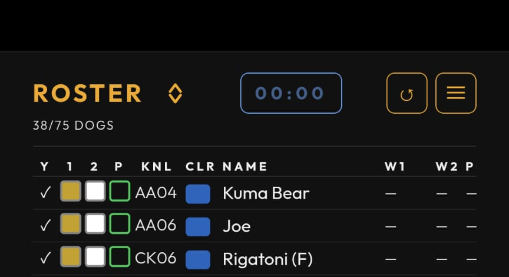

# Walker Guide

A tour of the app for shelter walkers.

## Signing in

DWA uses your Google account. Tap **Sign in with Google** on the launch screen
and pick your address. If you're new, you'll land on a request-access form —
fill it in and an admin will be notified. Once an admin approves you, you'll get
a welcome email, and your next Google sign-in will let you straight in. If
sign-in keeps failing, message an admin.

## The roster screen

The roster lists every adoptable dog in the kennel today, ordered by the current
sort (WALK ORDER by default). Each row shows, left to right:

- **Y** — yesterday's activity at a glance (walked once, twice, playgroup, or
  nothing / recent surgery).
- **1 · 2 · P** — status icons for Walk 1, Walk 2, and Playgroup. A filled,
  checked icon means done; an outline means pending. Color highlights flag what's
  urgent or reserved (see [Cell colors](#cell-colors)).
- **KNL** — the kennel to find the dog in (e.g. `AC03`).
- **CLR** — the dog's color grade (see [Color grades](#color-grades)).
- **NAME** — the dog's name.
- **W1 · W2 · PG** — the time each activity was logged, or a check once done.

**Tap any row to open the dog's page** — that's where you log walks now.

{:.wide}

## Logging a walk

Walks are logged on the **dog's page**, not from the roster row. Tap a dog to
open it, then under **ACTIVITY TODAY** you'll see up to three buttons:

- **Log Walk 1**
- **Log Walk 2** — locked until Walk 1 is logged.
- **Log Playgroup**

Tap a button to log that activity. Once logged, the button switches to show the
time it happened, e.g. **`W1 @ 8:47`**. To undo a mistake, tap the logged button
again to clear it. Each tap writes back to the shelter Google Sheet and syncs
across devices, so what you log shows up for everyone.

### Reservations

A dog can be reserved before you walk it. When so, a pill appears above the
buttons:

- **Reserved for Playgroup** (green) — hold the dog for playgroup.
- **Reserved for Training** (cyan) — the Walk 1 button also gets a cyan border;
  the dog is spoken for by training.

### Walk notes

Below the buttons, the dog's most recent note for each activity is shown. If
there's more than one note for an activity, a **`+N more`** link appears — tap it
to read the full history for that slot.

## Color grades

Every dog wears a color from easiest to hardest:

> Green →
> Pink →
> Aqua →
> Blue− →
> Blue →
> Gold− →
> Gold →
> Red →
> Black

Your own color grade (shown in **Settings → WALKER PROFILE**, set by an admin) is
the **hardest** color you're cleared to walk. You can walk any dog **at or below**
your grade. Dogs above your grade appear dimmed and drop to the bottom of the
list when a view-based sort like WALK ORDER is active.

## Cell colors

The status-icon highlights on the roster tell you what's pending:

- **Yellow / amber** on a walk icon — that walk slot is urgent.
- **Green** on Playgroup — the dog is reserved for playgroup but hasn't attended.
- **Cyan** on Walk 1 — the dog is reserved for training but hasn't walked.

Once an activity is logged, its highlight clears — the check wins over the color.

## The WALK ORDER sort

The default **WALK ORDER** sort puts the hardest color you can walk at the top.
Within a color, dogs run urgent (yellow) → amber → neutral → reserved → done.
Dogs above your color grade fall to the bottom, dimmed.

*This example is what an **Aqua**-level walker sees — which dogs sit at the top,
and which dim out, depends on your own color grade.*

Open the **SORT BY** overlay from the sort icon in the header to pick another
sort. View-based sorts like WALK ORDER are **one-way** orderings — the asc/desc
toggle only applies to plain field sorts (**Kennel**, **Color**, **Name**). Use
**CLEAR SORT** to drop back to the default.

## The shift timer

If you enable **Timer** in **Settings → APPEARANCE**, a small `mm:ss` timer
appears **on the roster page** — in the header (top nav) or bottom-right (bottom
nav). Tap it to open play / pause / reset controls. It's a shared shift timer —
resetting it resets it for the shift — and it caps at **30:00**.

## Resources

The **Resources** screen (in the nav menu) has two sections:

- **Adopter Resources** — a QR code for the adoption info page. Tap it to
  open, or let an adopter scan it to share the info.
- **Documentation** — a **Walker Guide** link that opens this guide in your
  browser.

## Settings

Open **Settings** from the nav menu. Walker-facing options:

- **WALKER PROFILE** — your color level (read-only, set by an admin) and an
  optional **alternate email**.
- **APPEARANCE** — **Theme** (dark / light), **Font size**, **Action buttons**
  (nav at top or bottom, for one-handed use), and the **Timer** toggle.
- **NOTIFICATIONS** — turn on **Push notifications** for your account (the first
  toggle asks the browser for permission).

## FAQ

**Where did the roster checkboxes go?** Walk logging moved to the dog's page —
tap a row, then use the **Log Walk** buttons under ACTIVITY TODAY.

**Why doesn't a logged walk show up immediately?** The write goes to the source
Sheet; the app reads from a mirror that syncs via `IMPORTRANGE`. Give it a few
seconds and refresh if needed.

**Why is a dog dimmed?** Its color grade is higher than yours. You can still open
it, but it's not on your walk list today.

**Where's refresh?** Top-right of the header. On mobile you can also pull the
roster down to refresh.
