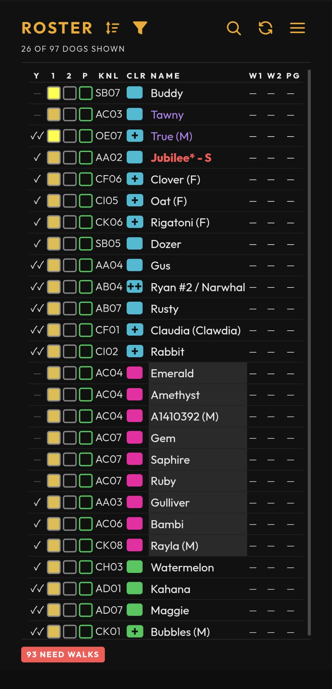
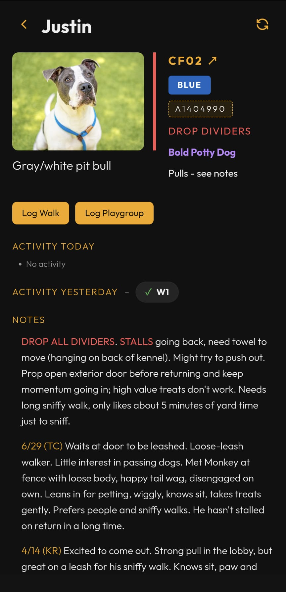
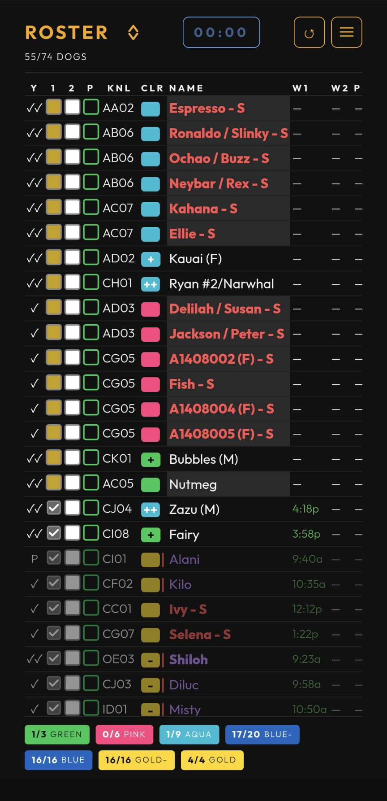
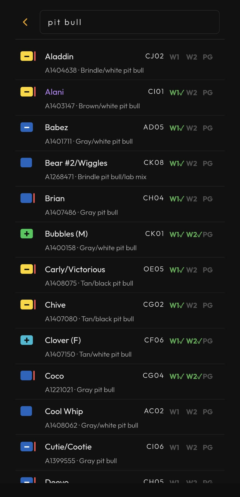
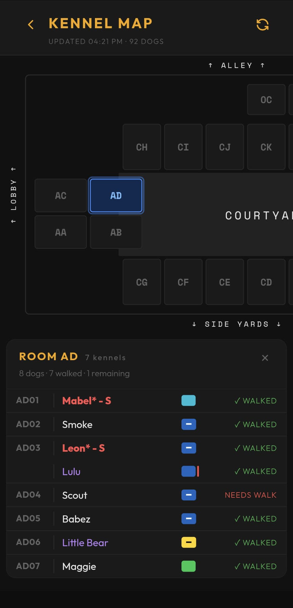
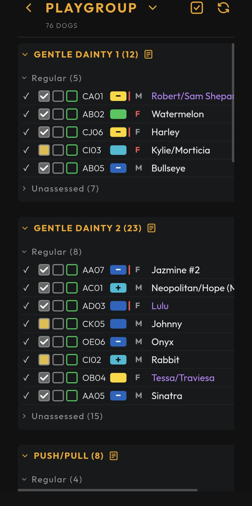

# Walker Guide

A tour of the app for shelter walkers.

Jump to&hellip;

- [Signing In](#signing-in)
- [Add To Your Home Screen](#add-to-your-home-screen)
- [The Roster Screen](#the-roster-screen)
- [The Dog Detail Page](#the-dog-detail-page)
- [Color Grades](#color-grades)
- [Cell Colors](#cell-colors)
- [The WALK ORDER Sort](#the-walk-order-sort)
- [Filters](#filters)
- [The Search Screen](#the-search-screen)
- [My Log](#my-log)
- [The Kennel Map](#the-kennel-map)
- [The Playgroup Screen](#the-playgroup-screen)
- [The Walk Timer](#the-walk-timer)
- [Action Buttons](#action-buttons)
- [Resources](#resources)
- [Settings](#settings)
- [FAQ](#faq)

## Signing in

DWA uses your Google account. Tap **Sign in with Google** on the launch screen
and pick your address. If you're new, you'll land on a request-access form —
fill it in and an admin will be notified. Once an admin approves you, you'll get
a welcome email, and your next Google sign-in will let you straight in. If
sign-in keeps failing, message an admin.

## Add to your home screen

Install DWA as an app icon so it opens full-screen, without the browser bar.

### Android (Chrome)

1. Open **dwa.kirbsauce.com** in Chrome.
2. Tap the **⋮** menu (top right) and choose **Add to Home screen** — or tap
   **Install** if Chrome already offered you a banner.
3. Confirm by tapping **Add** / **Install**.

### iOS (Safari)

1. Open **dwa.kirbsauce.com** in Safari.
2. Tap the **Share** icon (the square with an arrow pointing up).
3. Scroll down and tap **Add to Home Screen**.
4. Tap **Add** in the top right.

Either way, you'll get a DWA icon on your home screen that opens the app
full-screen, just like a native app.

## The roster screen

The roster lists every walkable dog in the kennel today, ordered by the current
sort (WALK ORDER by default). Each row shows, left to right:

- **Y** — yesterday's activity at a glance (walked once, twice, playgroup, or
  nothing / recent surgery).
- **1 · 2 · P** — status icons for Walk 1, Walk 2, and Playgroup. A filled,
  checked icon means done; an outline means pending. Color highlights flag what's
  urgent or reserved (see [Cell colors](#cell-colors)).
- **KNL** — the kennel to find the dog in (e.g. `AC03`).
- **CLR** — the dog's color grade (see [Color grades](#color-grades)).
- **NAME** — the dog's name.
- **W1 · W2 · PG** — the time each activity was logged, or a check once done.
- **⋮** — a kebab menu, shown if you're flagged as a **trainer** and/or
  **playgroup lead** (set by an admin), or if your account role is
  **admin**. Tap it for **Reserve for Training** /
  **Unreserve for Training** and/or **Reserve for Playgroup** / **Unreserve
  for Playgroup** — toggles the dog's reservation right from the roster, no
  confirm needed. See [Reservations](#reservations) for how a reservation
  then displays.

**Tap any row to open the dog's page** — that's where you log walks, check
kennel location, and read notes.

Below the table, a row of pills summarizes what's outstanding: a **`N NOT
WALKED`** count (dogs with no activity logged today) that's always shown — red
while dogs still need a walk, green once it hits zero — and, when applicable,
**`N TRAINING RSVD`** / **`N PLAYGROUP RSVD`** counts for dogs reserved but
not yet attended. These counts reflect the full roster regardless of any
active filter (see [Filters](#filters)).

## The dog detail page

- **ID** — tap it to copy the animal ID to your clipboard; the button flashes
  **Copied!** for a moment to confirm.
- **Kennel** (e.g. `AC03`) — tap it to jump straight to the **Kennel Map**,
  centered on that dog's room.
- **Photo** — tap it to view full-screen.
- Other information may show up below these, when it applies to that
  dog — flags like **Potty Dog**, **Recent surgery - NO RUNNING**, **Adoption
  hold**, **DROP DIVIDERS**, and **LIMITED ACTIVITY - SEE NOTES** (an
  activity restriction — check the dog's notes for details).

### Logging a walk

At the top of the page you'll see three buttons:

- **Log Walk 1** / **Log Walk 2** — separate buttons for each walk. Walk 2
  stays greyed out until Walk 1 is logged. Once logged, a button turns green
  and shows the time it happened, e.g. **`8:47am`**.
- **Log PG** — logs playgroup attendance, with the same green-with-time
  treatment once logged.

Tap an already-logged button to undo a mistake — a red-bordered
warning confirms first, showing how long ago it was logged, before
permanently clearing it. Walk 1 locks (can't be tapped) while Walk 2 is still
logged; clear Walk 2 first if you need to undo Walk 1.

**Walkers can't undo a walk more than 30 minutes after logging it** — the
button shows a notice asking you to contact an admin instead. Admins aren't
limited by this. Playgroup has no time limit.

#### Reservations

A dog can be reserved before you walk it. When so, a pill appears above the
buttons:

- **Reserved for Playgroup** (green) — hold the dog for playgroup.
- **Reserved for Training** (cyan) — the **Log Walk 1** button also gets a
  cyan border. Unlike other button styling, this doesn't clear once Walk 1
  is logged — it stays cyan until the training reservation itself is
  removed, the same behavior the roster's Walk 1 icon has (see [Cell
  Colors](#cell-colors)).

#### Activity notes

Below the buttons, each activity's most recent note from today is listed —
or **"No activity today"** if nothing's been logged yet. For the dog's full
history, see **Activity History** below.

#### Activity History

Below **ACTIVITY YESTERDAY**, tap **Activity History** to open the dog's
full W1/W2/PG note history, grouped by day with the most recent day first.
If the dog has no notes at all yet, it shows **"No history"** instead.

### Notes

Further down, a **NOTES** section holds the dog's ongoing care and behavior
notes — anything worth knowing before you walk it. Words in ALL CAPS (like
**DROP DIVIDERS** or **NO CATS**) are highlighted in red so warnings jump out.

### Tools

At the bottom, a **TOOLS** section links out to other systems:

- **Submit a Comment** / **Submit Medical Observation** / **Submit Behavior
  Observation** / **Submit Kennel Observation** — opens a form to report
  something about the dog or the kennel. Each form comes prepopulated with
  available information.
- **View on Pet Compass** / **View on Pet Harbor** — opens the dog's record in
  the county's own systems.
- **Verify Kennel** — cross-checks the dog's kennel against Pet Compass and
  flags it if they don't match.

## Color grades

Every dog wears a color from easiest to hardest:

> Green →
> Pink →
> Aqua →
> Blue− →
> Blue →
> Gold− →
> Gold →
> Red →
> Black

Your own color grade (shown in **Settings → WALKER PROFILE**, set by an admin) is
the **hardest** color you're cleared to walk. You can walk any dog **at or below**
your grade. Dogs above your grade appear dimmed and drop to the bottom of the
list when a view-based sort like WALK ORDER is active.

Dogs flagged for special handling always display as **Red**, regardless of
their usual color grade — treat these with the same caution as any other Red
dog.

## Cell colors

The status-icon highlights on the roster tell you what's pending:

- <strong style="color:#ffff00">Yellow</strong> /
  <strong style="color:#e3bd3e">amber</strong> on a walk icon — that walk
  slot is urgent.
- <strong style="color:#00c853">Green</strong> on Playgroup — the dog is
  reserved for playgroup but hasn't attended.
- <strong style="color:#00bcd4">Cyan</strong> on Walk 1 — the dog is reserved
  for training. Unlike the other highlights, this one doesn't clear once
  Walk 1 is logged — it stays cyan (with a checkmark drawn on top) until the
  training reservation itself is removed.

Once an activity is logged, its highlight clears and the check wins over the
color — except cyan, which persists for the life of the reservation (see
above).

## The WALK ORDER sort

The default **WALK ORDER** sort puts the hardest color you can walk at the top.
Within a color, dogs run urgent (yellow) → amber → neutral → reserved → done.
Dogs above your color grade fall to the bottom, dimmed.

*This example is what an **Aqua**-level walker sees — which dogs sit at the top,
and which dim out, depends on your own color grade.*

Open the **SORT BY** overlay from the sort icon in the header to pick another
sort. View-based sorts like WALK ORDER are **one-way** orderings — the
**A → Z / Z → A** toggle only applies to plain field sorts (**Kennel**,
**Color**, **Name**). Use **CLEAR SORT** to drop back to the default.

The overlay also offers a **PLAYGROUP** sort: instead of walk urgency, it
groups dogs already reserved for playgroup (and not yet attended) using the
same grouping as [the Playgroup screen](#the-playgroup-screen), with a
**REMAINING ROSTER** group underneath, in plain WALK ORDER, for everyone
else. If nobody's currently reserved, it shows **"No dogs currently reserved
for playgroup"** instead.

Both WALK ORDER and PLAYGROUP are available to every role, including guests —
since a guest account has no color grade of its own, it's treated as **Gold**
for grouping/dimming purposes in either sort.

## Filters

Tap the filter icon next to the sort icon to narrow the roster. **COLORS**
lets you multi-select color grades and either show only those (**ONLY**) or
hide them (**NOT**). Filters such as **Playgroup (reserved)**, **Training
(reserved)**, and **BMOD** (dogs flagged for behavior modification) each have
a checkbox to turn that filter on, plus an **ONLY** / **NOT** toggle for
which way it applies once checked — unchecking turns the filter off without
losing your ONLY/NOT choice. While any filter is active
the filter icon highlights and the count under **ROSTER** switches to
`SHOWING X OF Y DOGS`. Tap **CLEAR FILTERS** to reset everything.

## The Search screen

Open **Search** from the nav menu to find a dog by name, ID, kennel, breed,
color, or even a word from its notes — matches appear as you type, with name
matches listed first.

Each result shows the dog's color, name, kennel, and today's **W1 · W2 · PG**
ticks (green once logged). Tap a result to open that dog's page.

## My Log

Open **My Log** from the nav menu to see your own walk-toggle history — every
W1/W2/PG you've logged, newest first, grouped under **TODAY**, **YESTERDAY**,
and earlier day headings. Each row shows the time, the dog's name, and which
activity was toggled, with a green checkmark for checked or a red ✕ for
unchecked. Tap a row to open that dog's page.

## The Kennel Map

Open **Kennel Map** from the nav menu — or tap a dog's kennel on its detail
page to jump straight there, centered on that room.

Tap a room to see its kennels. Each row shows the dog's name, color, and walk
status (**✓ WALKED**, **✓ PLAYGROUP**, or **NEEDS WALK**), plus a running tally
of how many dogs in that room still need a walk. Tap a dog's row to open its
detail page.

Kennels that look empty, or dogs that aren't on your walk list, can still show
up here — the map cross-checks against Pet Compass, so it'll flag a mismatch
(⚠) if a dog is actually housed somewhere different than the roster says. A
dog with no Pet Compass record at all gets its own **⚠ NOT FOUND IN PC**
badge instead, not a mismatch to fix.

## The Playgroup screen

Open **Playgroup** from the nav menu to see the roster grouped the same way
the shelter's own Playgroup tracking does, rather than by walk urgency.

Dogs are grouped by their Playgroup **Style** — **Gentle Dainty 1**, **Gentle
Dainty 2**, **Push/Pull**, and **Rough/Rowdy** — each split into **Regular**
and **Unassessed** subgroups. Dogs with no Style or Cat info fall under
**Unassessed**. Dogs tagged for something other than regular playgroup show up
in their own groups instead: **Selectives** (subgrouped per selective tag,
with buddy dogs or a **NEED INSTRUCTIONS** note), **Projects**, and **No
Playgroup** (holds like **Does Not Benefit**, **Medical / Age**,
**Investigation**, or **Recent Surgery**). Each group header shows a count and
a chevron to collapse/expand it. Tap a dog's row to expand/collapse its PG
notes. Long-press (hold) a row to open the dog's detail page — double-click
does the same on desktop/mouse. Logging or unlogging a dog's playgroup
attendance is done from the dog's own page (see [FAQ](#faq)), not from this
screen.

Style/Cat/Buddies/Sex/Alt/Time/PG Notes update automatically as they change.
If a change was made by editing the Playgroup sheet directly rather than
through the app — e.g. staff physically moving a dog and updating the tab by
hand — it can take up to **~10 seconds** to show up here.

### Managing playgroup reservations

If you're flagged as a **playgroup lead** (set by an admin) or your account
role is **admin**, you get one extra tool:

- **Bulk Reserve** — a header icon that puts every row into a checkbox select
  mode, pre-checked for dogs already reserved. Check or uncheck any dogs, then
  **Save** (only the dogs you actually changed are sent) or **Cancel**
  (discards everything, no writes). Save shows a summary of how many dogs were
  reserved, unreserved, already correct (no change needed), and — if any
  failed to save — which ones, left selected so tapping Save again retries
  just those.

## The walk timer

If you enable **Timer** in **Settings → APPEARANCE**, a small `mm:ss` timer
appears **on the roster page** — in the header (top nav) or bottom-right (bottom
nav) — to help you keep track of how long you've had a dog out. Tap it to open
play / pause / reset controls, and reset it each time you head out with a new
dog. It caps at **30:00**.

## Action buttons

**Settings → APPEARANCE → Action buttons** lets you move the header's icon
buttons (back, refresh, menu, and so on) between **TOP** (the normal header) and
**BOTTOM** — a bar docked near the bottom of the screen instead. If you're
navigating the app one-handed, BOTTOM keeps those buttons within thumb reach
instead of making you stretch to the top of the screen.

## Resources

The **Resources** screen (in the nav menu) has five sections:

- **Guides** — a **Walker Guide** link that opens this guide in your browser
  (plus an **Admin Guide** link, admins only).
- **Submit an Observation** — the same **Submit a Comment** / **Submit
  Medical Observation** / **Submit Behavior Observation** / **Submit Kennel
  Observation** forms available from a dog's own Tools menu, but blank — from
  here there's no specific dog to pre-fill them with.
- **Adopter Resources** — a QR code for the adoption info page. Tap it to
  open, or let an adopter scan it to share the info.
- **Other** — **Pet Compass** / **Pet Harbor** links for looking up an
  animal directly, without a dog pre-filled (a dog's own Tools menu offers
  the same lookups already pointed at that dog).
- **Feedback** — a **Submit Bug/Enhancement** button for reporting a problem
  or requesting a feature.

## Settings

Open **Settings** from the nav menu. Walker-facing options:

- **WALKER PROFILE** — your color level (read-only, set by an admin). Hidden
  for **guest** accounts, which have no color grade of their own.
- **APPEARANCE** — **Theme** (dark / light), **Font size**, **Action buttons**
  (nav at top or bottom, for one-handed use), and the **Timer** toggle.
- **NOTIFICATIONS** — **Push notifications** shows your device's current
  permission as read-only status text: **ENABLED**, **NOT YET ENABLED**, or
  **BLOCKED — ENABLE IN DEVICE SETTINGS**. That row has no toggle — enabling or
  disabling notifications happens in your device's own settings. If you haven't
  enabled them yet, a banner may prompt you to **ENABLE** from the roster
  screen; tapping it triggers the one-time OS permission prompt.
  **Shift Reminders** (on by default) — after you log your first walk or
  playgroup of a shift, a prompt offers to send you to the Bloomerang kiosk to
  check in. Turn it off here.

## FAQ

**Where did the roster checkboxes go?** Walk logging moved to the dog's page —
tap a row, then use the **Log Walk** / **Log Playgroup** buttons above
**ACTIVITY TODAY**.

**Why didn't a logged walk show up right away?** Normally it does — writes push
an instant update to every connected device. If your phone was backgrounded
(screen locked or you switched apps) for a while, it may have missed that push;
it re-syncs the moment you bring the app back to the foreground. Still stale?
Pull to refresh.

**Why is a dog dimmed?** Its color grade is higher than yours. You can still open
it, but it's not on your walk list today.
